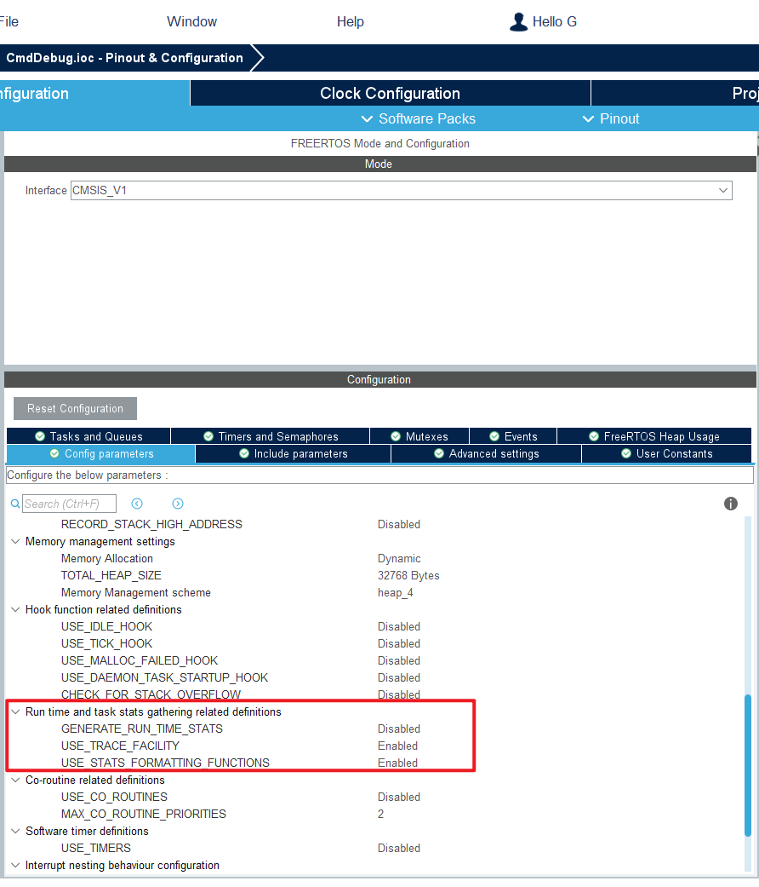
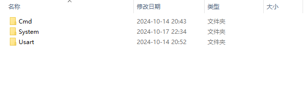
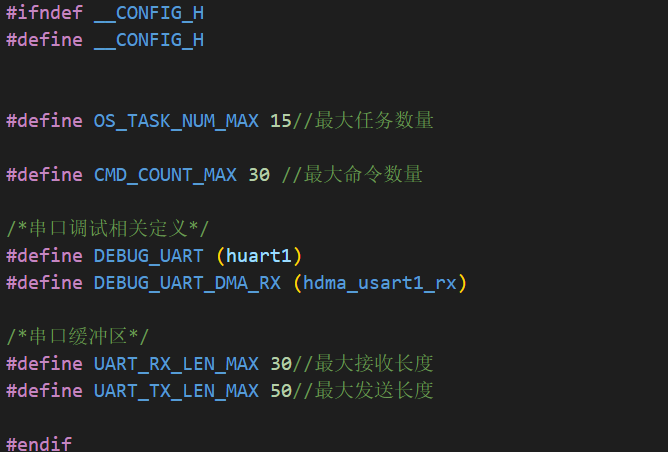
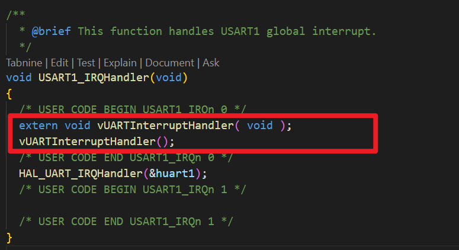
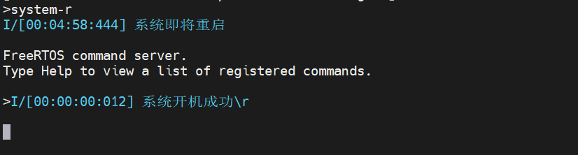
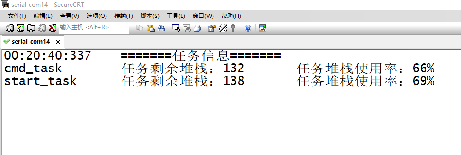
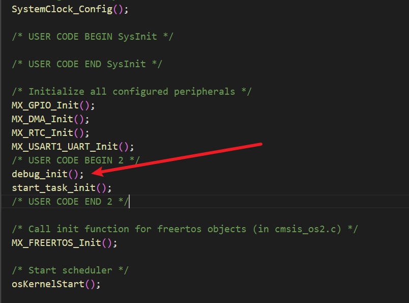
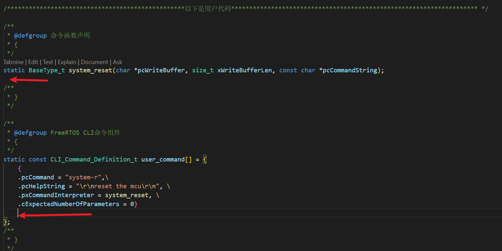
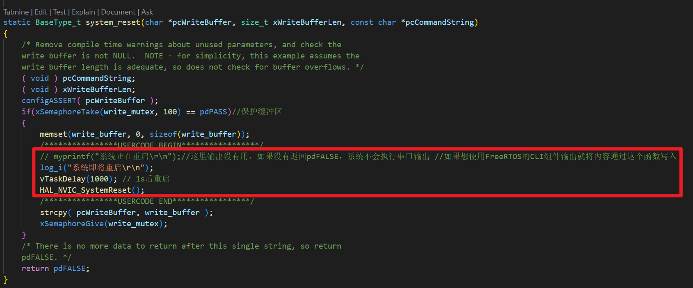

<!--
 * @Author: GYM-png 480609450@qq.com
 * @Date: 2024-10-17 22:16:25
 * @LastEditors: GYM-png 480609450@qq.com
 * @LastEditTime: 2024-10-25 23:22:48
 * @FilePath: \undefinedd:\warehouse\CmdDebug\CmdDebug\readme\readme.md
 * @Description: 这是默认设置,请设置`customMade`, 打开koroFileHeader查看配置 进行设置: https://github.com/OBKoro1/koro1FileHeader/wiki/%E9%85%8D%E7%BD%AE
-->
## Readme
本项目运行在FreeRTOS操作系统下，FreeRTOS相关配置如下：
使用CubeMx开启`configUSE_TRACE_FACILITY` 和 `configUSE_STATS_FORMATTING_FUNCTIONS`两个宏 

也可以在` FreeRTOSConfig.h` 文件中手动开启
```c
#define configUSE_TRACE_FACILITY                 1
#define configUSE_STATS_FORMATTING_FUNCTIONS     1
```
### 1.移植
1. 将`\UserCode\Cmd`文件夹、 `\UserCode\System` 文件夹、 `UserCode\Usart` 文件夹下的文件全部复制到自己的项目中。

1. 根据自身项目情况修改`config.h` 文件中的宏定义
   使用的串口号和dma直接在其中修改即可

1. 在调试串口对应的中断服务函数中加入FreeRTOS CLI组件回调函数
   ```c
	extern void vUARTInterruptHandler( void );
	vUARTInterruptHandler();
   ```

### 2.系统自带命令
- `help` :打印出所有命令
- `system-r` :系统重启复位
  
- `system-t` :打印出系统所有任务状态信息
  

### 3.API使用
#### 初始化
1. 包含头文件`#include "system.h"`
   包含该头文件后可直接使用log相关函数
2. 系统开启调度和使用log相关函数前调用初始化函数 `debug_init()`
   ```c
      debug_init();
   ```
   
#### 添加自己的命令
命令的实现是由FreeRTOS的CLI组件完成的
1. 添加命令回调函数声明，==注意函数需参数与给出实例完全相同==
2. 添加命令结构体，包含命令的各种参数
   1. `.pcCommand` ：命令字符串，==注意不要有空格，这个是FreeRTOS CLI组件原因，后续可能会改掉==
   2. `.pcHelpString`：提示字符串，用于help命令打印命令列表
   3. `.pxCommandInterpreter`：命令回调函数
   4. `.cExpectedNumberOfParameters`：默认为0就好
   ==添加命令结构体一定要在箭头处，也就是`user_command`这个数组内添加==
   
3. 实现自己的命令回调函数
   ==函数需以`system_reset`函数为模板来实现。在注释的用户代码区添加自己的代码==
   
   如果希望输出信息为日志则使用log相关函数，如果需要使用FreeRTOS CLI组件输出则使用`myprinrf` 函数，推荐使用log相关函数
### 4.待完善

- [x] 修改文件结构，所有对外配置在同一个头文件中
- [x] 完善对外暴露的API，实现易用，好用，逻辑顺畅
- [ ] ~~完善sys文件中的OS封装，实现任务的删除时从任务列表中移除~~
- [ ] ~~任务列表增加任务“就绪”“挂起”状态，通过封装OS的API实现任务状态追踪~~
- [x] 可能会移植EasyLogger，在此基础上实现日志输出
- [x] 移植FreeRTOS命令组件
- [x] uart封装为线程安全的发送函数，无需调用HAL库函数发送  