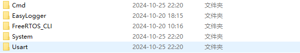
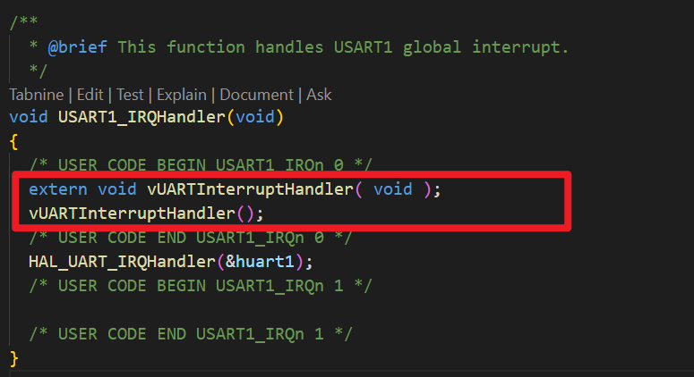
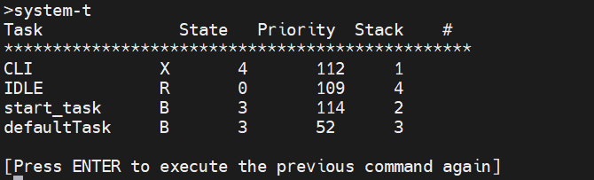
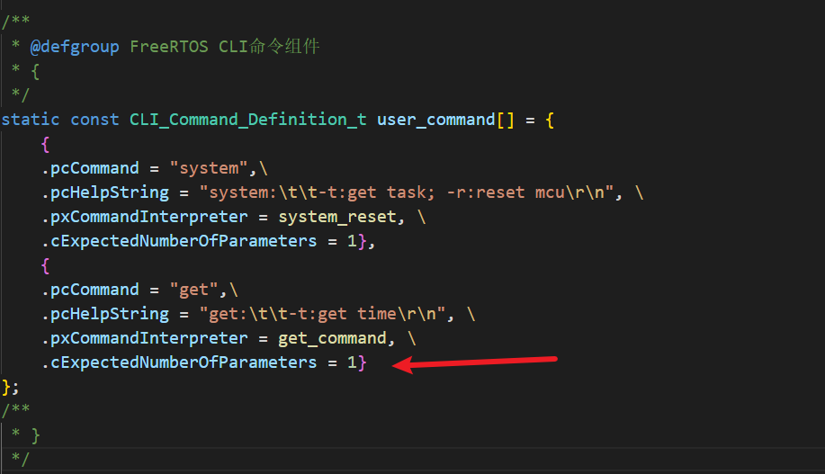

## 使用方法
本项目运行在FreeRTOS操作系统下
### 1.移植
1. 将`\UserCode\Cmd`文件夹、 `\UserCode\System` 文件夹、 `UserCode\Usart` 文件夹下的文件全部复制到自己的项目中。

2. 根据自身项目情况修改`config.h` 文件中的宏定义

3. 在调试串口对应的中断服务函数中加入回调函数
   ```c
   uart_idle_callback(&debug_uart);
   ```

### 2.系统自带命令
- `help` :打印出所有命令
- `system -r` :系统重启复位
- `system -t` :打印出系统所有任务状态信息
- `system -v` :打印出系统版本信息
- `get -t` :打印出系统当前时间
### 3.API使用
#### 任务创建 
动态创建任务时使用`system.c`文件下的 `myTaskCreat` API，该API调用了FreeRTOS的`xTaskCreat` API，因此该API入参和 `xTaskCreat` 完全一致
同时该API中加入了将任务信息加入任务列表的功能，使得可以直接调用系统自带命令`system -t`打印出通过该API创建的所有任务信息

#### 添加自己的命令
用户命令的回调函数需用户实现，函数入参和返回都是 `void` ，然后调用 `\UserCode\Cmd\cmd.c` 的 `cmd_install` 函数注册命令


### 4.待完善

- [x] 修改文件结构，所有对外配置在同一个头文件中
- [ ] 完善对外暴露的API，实现易用，好用，逻辑顺畅
- [ ] 完善sys文件中的OS封装，实现任务的删除时从任务列表中移除
- [ ] 任务列表增加任务“就绪”“挂起”状态，通过封装OS的API实现任务状态追踪
- [ ] 可能会移植EasyLogger，在此基础上实现日志输出