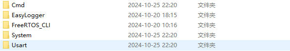

## Readme
这是一个基于FreeRTOS CLI组件的Easylogger移植，更改了部分CLI代码，实现更符合linux习惯的命令行操作
FreeRTOS相关配置如下：
使用CubeMx开启`configUSE_TRACE_FACILITY` 和 `configUSE_STATS_FORMATTING_FUNCTIONS`两个宏 


也可以在` FreeRTOSConfig.h` 文件中手动开启
```c
#define configUSE_TRACE_FACILITY                 1
#define configUSE_STATS_FORMATTING_FUNCTIONS     1
```
### 1.移植
1. 将`\UserCode\Cmd`文件夹、 `\UserCode\System` 文件夹、 `UserCode\Usart` 文件夹下的文件全部复制到自己的项目中。

1. 根据自身项目情况修改`config.h` 文件中的宏定义
   使用的串口号和dma直接在其中修改即可

1. 在调试串口对应的中断服务函数中加入FreeRTOS CLI组件回调函数
   ```c
	extern void vUARTInterruptHandler( void );
	vUARTInterruptHandler();
   ```

### 2.系统自带命令
- `help` :打印出所有命令
  
- `system -r` :系统重启复位
  
- `system -t` :打印出系统所有任务状态信息
  

### 3.API使用
#### 初始化
1. 包含头文件`#include "system.h"`
   包含该头文件后可直接使用log相关函数
2. 系统开启调度和使用log相关函数前调用初始化函数 `debug_init()`
   ```c
      debug_init();
   ```
   
#### 添加自己的命令
命令的实现是由FreeRTOS的CLI组件完成的
1. 添加命令回调函数声明，==注意函数需参数与给出实例完全相同==
2. 添加命令结构体，包含命令的各种参数
   1. `.pcCommand` ：命令字符串，==注意不要有空格，这个是FreeRTOS CLI组件原因，后续可能会改掉==
   2. `.pcHelpString`：提示字符串，用于help命令打印命令列表
   3. `.pxCommandInterpreter`：命令回调函数
   4. `.cExpectedNumberOfParameters`：命令的参数数量
   ==添加命令结构体一定要在箭头处，也就是`user_command`这个数组内添加==
   
3. 实现自己的命令回调函数
   这里给出函数模板
   1. 将`uxParameterNumber`  更改为对应命令的参数数量
   2. 在用户代码区添加自己的代码
   如果需要打印输出信息，使用Easylogger的API即可
   ```c
   static BaseType_t callback_template( char *pcWriteBuffer, size_t xWriteBufferLen, const char *pcCommandString )
   {
   static UBaseType_t uxParameterNumber = 1;   //总参数个数
      ( void ) pcCommandString;
      ( void ) xWriteBufferLen;
      configASSERT( pcWriteBuffer );
      pcWriteBuffer[0] = '\0';        
      char **parameterArray = (char **)pvPortMalloc(sizeof(char *) * uxParameterNumber);
      if (parameterArray == NULL)
      {
         log_e("内存分配失败 \r\n");
         vPortFree(parameterArray);
         return pdFALSE;
      }
      if (find_parameters(pcCommandString, uxParameterNumber, parameterArray) == 0)
      {
         log_i("没有找到参数 \r\n");
         return pdFALSE;
      }
      /*****************user code begin*****************/
      if (strstr(parameterArray[0], "t"))//如果有参数需要对比 parameterArray数组存放了所有参数，可以提取出来进行比对或者操作
      {

      }
      /*****************user code end*****************/
      return pdFALSE;
   }
   ```
### 4. 命令讲解
   - 无参数命令：单纯的字符串，只能实现一种功能,例如：`"hello"`
   - 有参数命令：字符串后以`" -"`分隔参数，同样字符串后面参数不同可以识别出来，例如：`"system  -t"` 和 `"system -r"`
   ==需要注意的是，参数一定的跟在`" -"`后面，而不是单纯的`'-'`==
### 5.计划

- [x] 修改文件结构，所有对外配置在同一个头文件中
- [x] 完善对外暴露的API，实现易用，好用，逻辑顺畅
- [ ] ~~完善sys文件中的OS封装，实现任务的删除时从任务列表中移除~~
- [ ] ~~任务列表增加任务“就绪”“挂起”状态，通过封装OS的API实现任务状态追踪~~
- [x] 可能会移植EasyLogger，在此基础上实现日志输出
- [x] 移植FreeRTOS命令组件
- [x] uart封装为线程安全的发送函数，无需调用HAL库函数发送  
- [x] 优化FreeRTOS CLI组件，自写参数提取函数，使命令行格式完全符合linux，以‘-’分隔参数 
- [ ] 优化命令查找函数，使其能自适应命令数量
- [ ] 增加历史命令查找功能，键盘上键能浏览历史命令
- [ ] 移植SFUD操作SPI Flash
- [ ] 移植Fatfs文件系统纪录日志